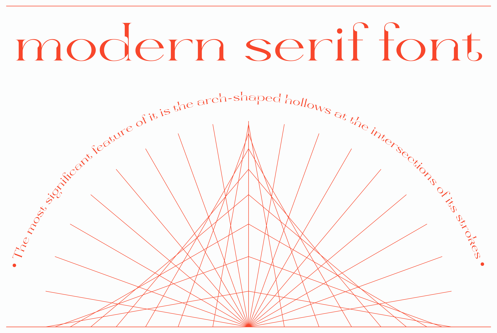
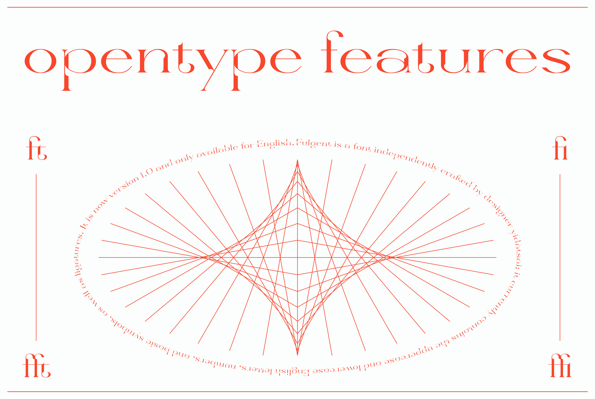
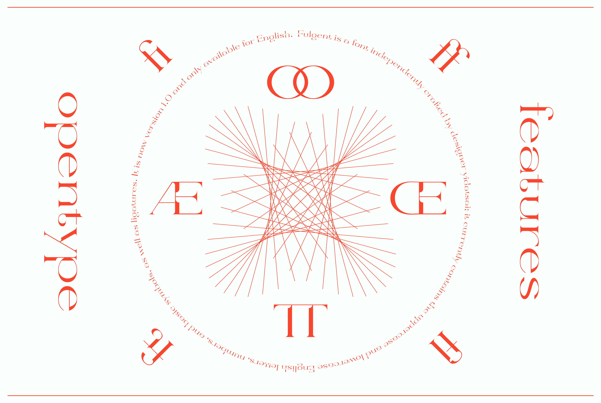
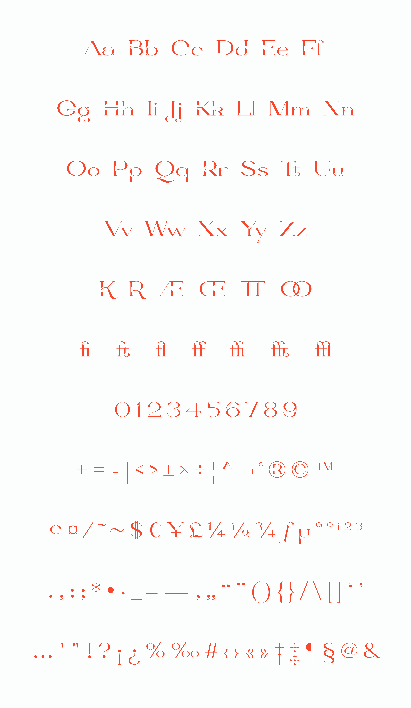
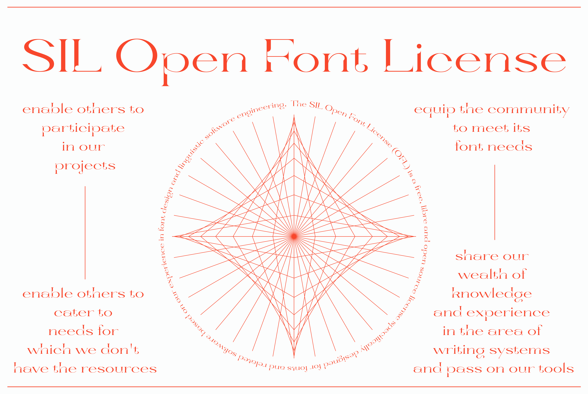

# Fulgent-typeface

## About
* Fulgent is a display serif font with high contrast stroke. The most significant feature of it is the arch-shaped hollows at the intersections of its strokes, which enlarges the counter and aperture of alphabets,  brightening the appearance of the font.

* Fulgent is a font independently crafted by designer yidatsai; it currently contains the uppercase and lowercase English letters, numbers, and basic symbols, as well as ligatures. It is now version 1.0 and only available for English.

## Designer
* sth_of_yidatsai

  → [Instagram](https://www.instagram.com/sth_of_yidatsai/)

  → [Behance](https://www.behance.net/sth_of_yidatsai/projects)
## License

* Fulgent is licensed under the [SIL Open Font License](license.txt), Version 1.1.

* This license is copied below, and is also available with a FAQ at:
http://scripts.sil.org/OFL
